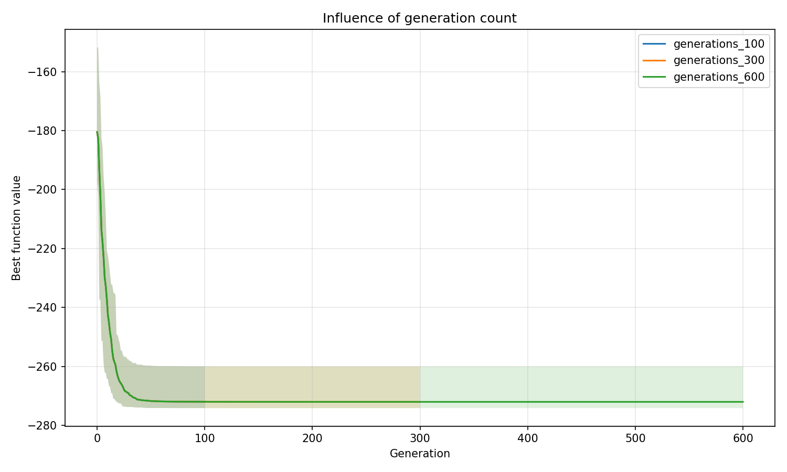
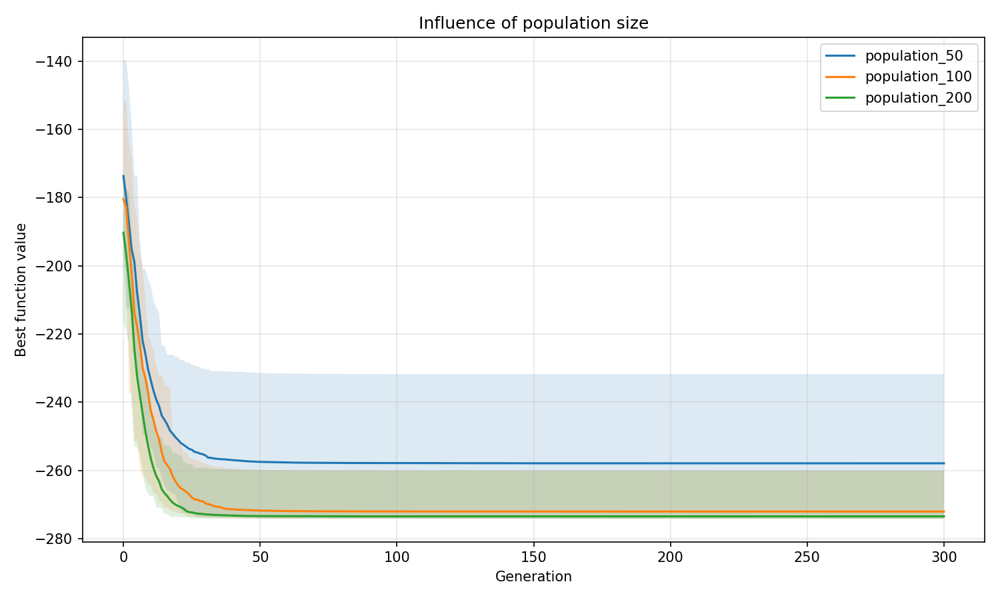
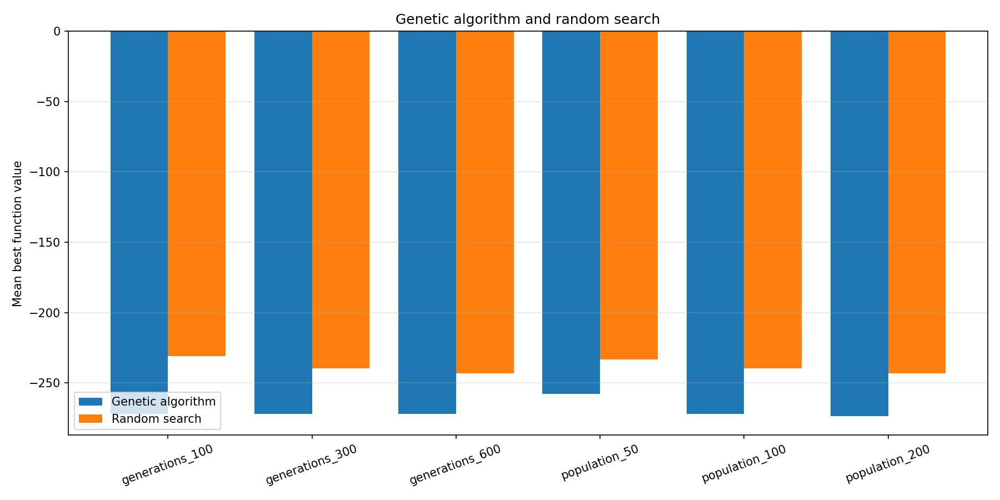

# Лабораторная работа № 1

## Многомерная оптимизация функции Стыблинского—Танга генетическим алгоритмом

## 1. Постановка задачи

Номер варианта:

```text
V = 1 + ((17 · 31 + 7 · 0 + 26) mod 20) = 14
```

Размерность:

```text
d = 5 + (V mod 6) = 7
```

Требуется найти минимум функции Стыблинского—Танга в области `[-5, 5]^7`:

```text
f(x) = 0.5 · Σ(xᵢ⁴ - 16xᵢ² + 5xᵢ), i = 1..7.
```

Теоретический глобальный минимум достигается приблизительно в точке:

```text
x* = (-2.903534, -2.903534, -2.903534, -2.903534,
      -2.903534, -2.903534, -2.903534)
f(x*) ≈ -274.163160.
```

## 2. Представление решения и алгоритм

Особь — вещественный вектор `x = (x₁, ..., x₇)`. Популяция хранится в матрице `X`: строка `X[i]` соответствует одной особи.

Начальная популяция равномерно генерируется в области `[-5, 5]^7`. Генотип и фенотип совпадают; декодирование не требуется.

Используемый генетический алгоритм:

1. Для каждой особи вычисляется значение целевой функции.
2. Лучшие 10% особей копируются в следующее поколение без изменений.
3. Ещё 70% особей выбираются рулеточной селекцией. Для задачи минимизации используются веса `max(y) - yᵢ`.
4. Недостающие 20% составляют дети. Для ребёнка случайно выбираются два родителя; 3 гена берутся от первого родителя и 4 — от второго.
5. Каждый ген неэлитного родителя и ребёнка мутирует с вероятностью 5%. Изменение задаётся нормальным распределением `N(0, 0.5)`.
6. После мутации значения ограничиваются функцией `clip` диапазоном `[-5, 5]`.
7. Остановка происходит после заданного числа поколений.

Вещественное представление напрямую соответствует непрерывной задаче. Рулеточная селекция усиливает вероятность лучших решений, 
равномерное скрещивание комбинирует координаты родителей, а гауссовская мутация позволяет исследовать окрестность найденных решений.

## 3. Параметры экспериментов

Для каждой конфигурации выполнено 20 независимых запусков с `seed` от 101 до 120. Вероятность мутации равна 5%, 
масштаб мутации — 0.5, элитизм — 10%, доля рулеточной селекции — 70%, скрещивание выполняется для каждого нового ребёнка. 
В первых трёх конфигурациях меняется только число поколений, во вторых трёх — только размер начальной популяции.

| Конфигурация | Размер популяции | Поколений | Бюджет вычислений `f` |
|---|---:|---:|---:|
| `generations_100` | 100 | 100 | 10 100 |
| `generations_300` | 100 | 300 | 30 100 |
| `generations_600` | 100 | 600 | 60 100 |
| `population_50` | 50 | 300 | 15 050 |
| `population_100` | 100 | 300 | 30 100 |
| `population_200` | 200 | 300 | 60 200 |

Бюджет случайного поиска в каждом запуске равен бюджету соответствующей конфигурации ГА.

## 4. Результаты

В файле `Exp.csv` сохранены параметры, seed, лучшие решения, значения целевой функции, результаты случайного поиска и история сходимости всех 120 запусков.

В таблице приведены результаты ГА по 20 запускам. `σ` — выборочное стандартное отклонение.

| Конфигурация | Лучшее | Среднее | Медиана | σ | Худшее | Среднее random | Побед ГА |
|---|---:|---:|---:|---:|---:|---:|---:|
| `generations_100` | -274.154143 | -272.017139 | -274.137603 | 5.178753 | -259.989446 | -230.747477 | 20/20 |
| `generations_300` | -274.163051 | -272.041873 | -274.162314 | 5.178990 | -260.025354 | -239.419757 | 20/20 |
| `generations_600` | -274.163125 | -272.042519 | -274.163059 | 5.179026 | -260.025701 | -243.219011 | 20/20 |
| `population_50` | -274.162962 | -257.903624 | -260.023670 | 13.967970 | -231.750915 | -233.363749 | 18/20 |
| `population_100` | -274.163051 | -272.041873 | -274.162314 | 5.178990 | -260.025354 | -239.419757 | 20/20 |
| `population_200` | -274.163119 | -273.456099 | -274.162959 | 3.161111 | -260.026029 | -243.219011 | 20/20 |



*Рисунок 1 — среднее лучшее значение функции; полупрозрачная область показывает минимум и максимум по 20 запускам.*



*Рисунок 2 — влияние размера популяции на сходимость.*



*Рисунок 3 — сравнение средних лучших значений ГА и случайного поиска.*

## 5. Анализ

ГА нашёл значение `-274.163125`, отличающееся от теоретического минимума менее чем на `0.000035`. 
Наиболее устойчивой оказалась конфигурация `population_200`: её среднее значение равно `-273.456099`, стандартное отклонение — `3.161111`.

Увеличение числа поколений с 300 до 600 почти не изменило среднее значение. Основное улучшение достигается в первых 300 поколениях. 
Популяция из 50 особей заметно менее устойчива: часть запусков попала в локальные минимумы.

Функция сложна для локального и случайного поиска, так как имеет много локальных минимумов. 
По отдельным координатам возможна остановка около `xᵢ ≈ 2.7468` вместо глобально оптимального значения `xᵢ ≈ -2.9035`. 
Из-за этого решение может быть близким к оптимальному по части координат, но существенно хуже глобального минимума.

ГА оказался лучше случайного поиска во всех 20 запусках для пяти конфигураций и в 18 из 20 запусков при популяции 50. 
Это подтверждает, что селекция, скрещивание и мутация используют вычислительный бюджет эффективнее случайной выборки.

## 6. Вывод

Реализован генетический алгоритм для минимизации функции Стыблинского—Танга в семимерном пространстве. 
Алгоритм стабильно находит решения, близкие к глобальному минимуму, и превосходит случайный поиск при равном числе вычислений целевой функции.
Увеличение размера популяции до 200 особей повысило устойчивость результатов, а увеличение числа поколений после 300 дало небольшой дополнительный эффект.