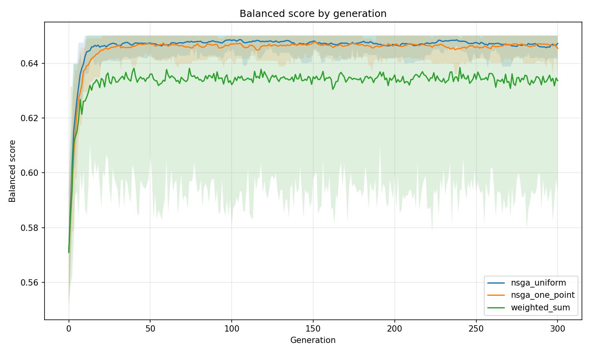
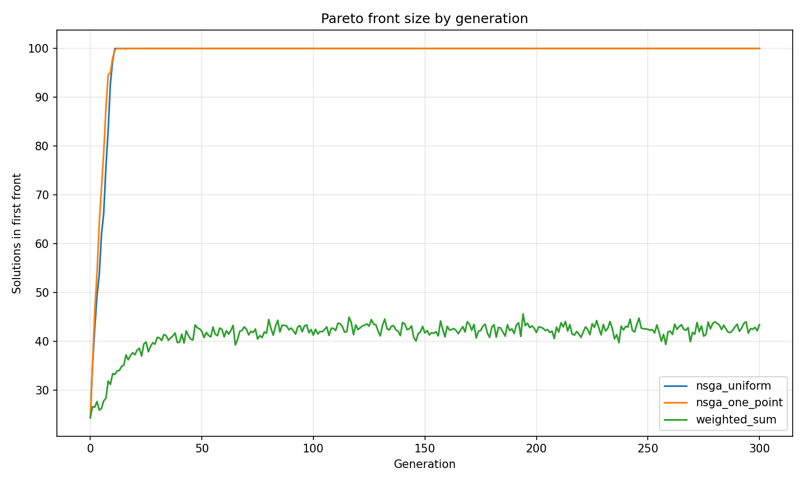
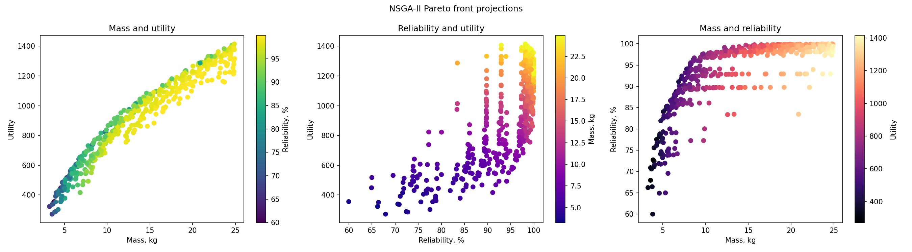
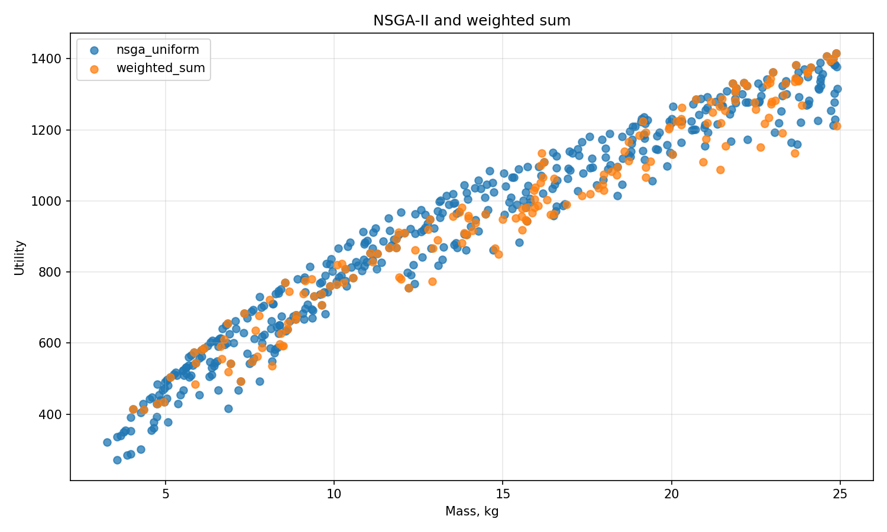
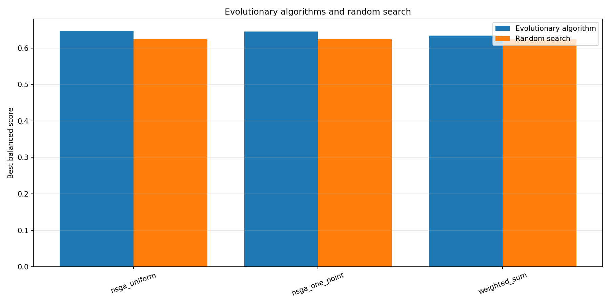

# Лабораторная работа №3

## Многокритериальная оптимизация набора оборудования для экспедиции алгоритмом NSGA-II

### Вариант

Номер варианта:

```text
V = 1 + ((17 * 31 + 7 * 0 + 26) mod 20) = 14
```

Вариант 14 — компоновка набора оборудования для экспедиции: максимум полезности, минимум массы, максимум надёжности.

## Постановка задачи

Дан набор из 30 предметов для экспедиции. Каждый предмет имеет полезность, массу, надёжность и принадлежит к одной из пяти категорий:

- укрытие;
- сон;
- навигация;
- приготовление пищи;
- медицина.

Необходимо выбрать набор предметов, который соответствует всем обязательным категориям и имеет массу не более 25 кг.

В отличие от задачи с одним критерием, нельзя указать один безусловно лучший комплект. Добавление предмета обычно увеличивает полезность и надёжность, но одновременно увеличивает массу. Поэтому требуется получить фронт Парето — набор разных хороших компромиссов.

## Представление особи

Особь представляется бинарным массивом длины 30:

```text
x = [x1, x2, ..., x30], xi ∈ {0, 1}
```

Значение `1` означает, что предмет выбран в экспедицию, `0` — что предмет не выбран.

Например:

```text
[0 1 0 0 0 0 0 1 0 0 1 0 ...]
```

Такое представление напрямую задаёт состав комплекта, поэтому дополнительное декодирование не требуется.

## Входные данные

Используются синтетические входные данные из 30 предметов. Для каждого предмета фиксируются:

- название;
- категория;
- полезность;
- масса в килограммах;
- вероятность безотказной работы.

Данные генерируются с фиксированным `seed = 1400` и сохраняются в файл:

```text
Equipment.csv
```

Использование фиксированного seed делает эксперименты воспроизводимыми.

## Целевые функции

Для выбранного комплекта `x` оптимизируются три критерия:

```text
f1(x) = Σ utilityi * xi → max
f2(x) = Σ massi * xi → min
f3(x) = R(x) → max
```

где:

- `f1(x)` — суммарная полезность выбранных предметов;
- `f2(x)` — суммарная масса комплекта;
- `f3(x)` — надёжность комплекта в процентах.

Для каждой категории вычисляется вероятность того, что хотя бы один выбранный предмет этой категории будет работоспособен:

```text
Rc = 1 - Π(1 - ri)
```

где `ri` — надёжность выбранного предмета категории `c`.

Общая надёжность комплекта равна произведению надёжностей всех пяти обязательных категорий:

```text
R(x) = Rукрытие * Rсон * Rнавигация * Rпитание * Rмедицина * 100%
```

Резервные предметы повышают надёжность категории, но увеличивают массу набора.

Алгоритм NSGA-II решает задачу минимизации, поэтому в программе используется вектор:

```text
F(x) = [-f1(x), f2(x), -f3(x)]
```

Минимизация отрицательной полезности и отрицательной надёжности эквивалентна максимизации исходных критериев.

## Ограничения

Для каждого комплекта должны выполняться условия:

```text
f2(x) <= 25 кг
```

и в наборе должен быть хотя бы один предмет каждой из пяти обязательных категорий.

Программа сохраняет два допустимых и два недопустимых примера в файле:

```text
Examples.csv
```

| Пример | Полезность | Масса, кг | Надёжность, % | Допустимость |
|---|---:|---:|---:|---|
| `valid_light` | 372 | 4.80 | 68.54 | Да |
| `valid_extended` | 781 | 9.32 | 89.10 | Да |
| `invalid_without_navigation` | 290 | 2.07 | 0.00 | Нет, нет навигации |
| `invalid_overweight` | 2064 | 57.11 | 100.00 | Нет, превышена масса |

## Генетический алгоритм NSGA-II

Работа алгоритма состоит из следующих этапов:

```text
Создание допустимой популяции
        ↓
Расчёт трёх критериев
        ↓
Недоминационная сортировка
        ↓
Расстояние до скопления
        ↓
Турнирный отбор родителей
        ↓
Кроссовер и мутация
        ↓
Repair ограничений
        ↓
Объединение родителей и потомков
        ↓
Отбор следующей популяции
```

В обычном генетическом алгоритме особи сравниваются по одному значению fitness. В NSGA-II сначала сравнивается номер фронта Парето: чем он меньше, тем лучше особь. Если две особи находятся в одном фронте, предпочтение получает особь с большим расстоянием до скопления. Это позволяет сохранять решения из разных частей фронта, а не только похожие наборы.

Начальная популяция сразу создаётся допустимой. После кроссовера и мутации применяется repair:

- для отсутствующей категории добавляется предмет с наилучшим отношением `полезность * надёжность / масса`;
- при превышении 25 кг удаляется наименее выгодный предмет, если в его категории остаётся хотя бы ещё один предмет.

Поэтому все особи финальных популяций допустимы.

## Кроссовер и мутация

Для NSGA-II сравниваются два содержательно разных варианта кроссовера.

### Равномерный кроссовер

Для каждого гена случайно выбирается, от какого из двух родителей он будет взят.

```text
родитель 1: [1 0 1 0 1]
родитель 2: [0 1 0 1 0]
ребёнок:    [1 1 1 1 0]
```

### Одноточечный кроссовер

Выбирается точка разреза: часть генов берётся у первого родителя, оставшаяся часть — у второго.

```text
родитель 1: [1 0 | 1 0 1]
родитель 2: [0 1 | 0 1 0]
ребёнок:    [1 0 | 0 1 0]
```

После кроссовера каждый ген ребёнка мутирует с вероятностью 5%:

```text
0 -> 1
1 -> 0
```

## Эксперименты

Для каждой конфигурации выполнено 20 независимых запусков с `seed` от 201 до 220.

| Конфигурация | Алгоритм | Кроссовер | Размер популяции | Поколений | Мутация |
|---|---|---|---:|---:|---:|
| `nsga_uniform` | NSGA-II | Равномерный | 100 | 300 | 5% |
| `nsga_one_point` | NSGA-II | Одноточечный | 100 | 300 | 5% |
| `weighted_sum` | ГА со взвешенной суммой | Равномерный | 100 | 300 | 5% |

Для NSGA-II каждая особь оценивается в начальной популяции и затем для каждого поколения потомков. Бюджет одного запуска составляет:

```text
100 * (300 + 1) = 30 100 оценок
```

Для сравнения случайный поиск также создаёт 30 100 допустимых комплектов.

## Сравнение со взвешенной суммой

В отдельной конфигурации три критерия сворачиваются в одно значение:

```text
S(x) = w1 * f1(x) / f1max + w2 * (1 - f2(x) / 25) + w3 * f3(x) / 100
```

В разных запусках последовательно используются веса:

```text
(0.60, 0.20, 0.20)
(0.20, 0.60, 0.20)
(0.20, 0.20, 0.60)
(0.34, 0.33, 0.33)
```

Такой подход требует заранее выбрать важность критериев и в каждом запуске усиливает одно направление поиска. NSGA-II не требует фиксировать веса: он одновременно строит набор компромиссных решений.

Для единого численного сравнения со случайным поиском используется сбалансированная оценка:

```text
Sbalanced(x) = (f1(x) / f1max + 1 - f2(x) / 25 + f3(x) / 100) / 3
```

Она используется только для отчётного сравнения и выбора одного сбалансированного представителя, но не заменяет критерии в NSGA-II.

## Результаты

В файле `Exp.csv` сохранены параметры, seed, размер фронта, лучший сбалансированный набор, результат случайного поиска и история всех 60 запусков.

| Конфигурация | Средний размер первого фронта | Средняя `Sbalanced` | Стандартное отклонение | Лучшая `Sbalanced` | Средняя random | Побед над random |
|---|---:|---:|---:|---:|---:|---:|
| `nsga_uniform` | 100.0 | 0.647188 | 0.002378 | 0.650069 | 0.623711 | 20/20 |
| `nsga_one_point` | 100.0 | 0.645422 | 0.002990 | 0.650069 | 0.623711 | 20/20 |
| `weighted_sum` | 43.4 | 0.633634 | 0.019311 | 0.650069 | 0.623711 | 15/20 |

У двух конфигураций NSGA-II весь размер финальной популяции попадает в первый фронт. Это ожидаемо для трёх противоречивых критериев: у лёгкого решения меньше масса, а у более полного решения больше полезность и надёжность. Расстояние до скопления не даёт популяции состоять только из похожих компромиссов.



*Рисунок 1 — средняя лучшая сбалансированная оценка по поколениям; полупрозрачная область показывает минимум и максимум по 20 запускам.*



*Рисунок 2 — средний размер первого фронта Парето по поколениям.*



*Рисунок 3 — три проекции фронта Парето, найденного NSGA-II с равномерным кроссовером.*



*Рисунок 4 — решения NSGA-II и подхода со взвешенной суммой в проекции «масса — полезность».*



*Рисунок 5 — средняя лучшая сбалансированная оценка эволюционных алгоритмов и случайного поиска.*

## Характерные решения фронта Парето

Файл `Pareto_solutions.csv` содержит характерные решения. Для `nsga_uniform` были получены следующие компромиссы:

| Тип решения | Полезность | Масса, кг | Надёжность, % |
|---|---:|---:|---:|
| Лёгкое | 322 | 3.26 | 66.21 |
| Максимально полезное | 1415 | 24.88 | 98.13 |
| Максимально надёжное | 1230 | 24.84 | 99.97 |
| Сбалансированное | 808 | 10.33 | 97.19 |

Лёгкий набор содержит по одному предмету из каждой категории и удобен, если масса является главным ограничением. Максимально полезный и максимально надёжный наборы близки к пределу в 25 кг: в них есть резервные предметы, поэтому вероятность отказа существенно ниже.

Сбалансированный набор содержит:

```text
Tarp, Bivy, Sleeping_mat, Pillow, GPS_navigator, Batteries,
Pot, Water_filter, Flask, Medicines, Antiseptic, Splint
```

Его масса составляет 10.33 кг, а надёжность — 97.19%. Он заметно легче наиболее надёжного варианта, но сохраняет высокий уровень полезности и резервирования.

## Сравнение операторов и методов

Равномерный кроссовер показал немного лучшую среднюю сбалансированную оценку:

```text
nsga_uniform:   0.647188
nsga_one_point: 0.645422
```

Разница небольшая, но равномерный кроссовер немного стабильнее: стандартное отклонение равно `0.002378` против `0.002990`. Оба варианта нашли одинаковые крайние компромиссы фронта.

Подход со взвешенной суммой в среднем хуже и заметно менее устойчив:

```text
weighted_sum: 0.633634, σ = 0.019311
```

Он превзошёл случайный поиск только в 15 из 20 запусков, тогда как обе конфигурации NSGA-II сделали это во всех 20 запусках. Это показывает ограничение взвешенной свёртки: её результат зависит от заранее выбранных весов, а часть компромиссных решений может быть потеряна.

## Вывод

В ходе лабораторной работы реализован алгоритм NSGA-II для многокритериального подбора оборудования экспедиции.

Особь представляется бинарной строкой из 30 генов. Одновременно оптимизируются полезность, масса и надёжность комплекта при ограничении 25 кг и обязательном наличии пяти категорий оборудования.

Были реализованы недоминационная сортировка, расстояние до скопления, турнирный отбор, равномерный и одноточечный кроссоверы, битовая мутация и восстановление допустимости.

NSGA-II сформировал фронт Парето с лёгкими, полезными, надёжными и сбалансированными комплектами. В проведённых экспериментах равномерный кроссовер показал лучший средний результат `0.647188` и превзошёл случайный поиск во всех 20 запусках. Взвешенная сумма также находит хорошие решения, но зависит от выбора весов и в среднем уступает NSGA-II.
